# Fresh session loading with real local data

The headline [full original-before/current comparison](./tab-switch-full-comparison.md) reruns this report's original baseline against the complete optimized build. This report preserves the history-gate diagnosis and its first fix; later per-pass engineering details are in [the follow-up report](./tab-switch-real-fast.md).

The earlier 65 ms result was a **prefetched-data rendering measurement**, not the end-to-end time to open an unvisited session from the local database. It did not exercise normal 20-message pagination and its history-preparation gate. The user's approximately 0.5-second blank transcript was reproduced with real data.

## Reproduction And Cause

The existing desktop-local service was discovered from its registration and used without restarting it. The desktop's debugging endpoint was unresponsive, so this investigation used an isolated Chromium renderer with the production app bundle against that same running service. The viewport was 1440 x 900, with fresh default renderer preferences, no CPU throttle, and blocked service workers; the user's saved desktop preferences were not copied. A loopback proxy supplied authentication, preserved response compression, and allowed only GET/HEAD. There were no API fixtures or destination-message prefetches in these measurements. This is real-API/data evidence, **not a capture of the user's Electron development renderer**.

The first three affected sessions measured 587, 553, and 363 ms to visible content. Their message requests completed in approximately 3-33 ms. The critical path was in the client:

1. `packages/client/src/solid/data.ts:1428-1446` fetches 20 messages and reverses the descending response for display.
2. `packages/app/src/session/timeline/model.ts` calls `enrichLeadingTurn` when the loaded window starts with an assistant before any user/shell boundary. This concerns the oldest part of the loaded window, not necessarily the latest response.
3. Enrichment waits 200 ms **before each** older-page request, up to three additional pages. Finding the original parent can expose another older partial group, causing another iteration.
4. The previous `ready` check withheld the entire transcript while that leading group remained partial. `packages/app/src/session/screen.tsx:110-141` rendered only the identity header instead of `MessageTimeline`.

Thus, two additional pages introduced 400 ms of explicit waiting even though the recent prompt and response were already available. The local API was not the primary delay in these reproduced cases. This does not establish that every session or endpoint is fast.

## Change

`packages/app/src/session/timeline/model.ts:34-37` now permits a nonempty loaded history to render. The existing bounded parent enrichment continues in the background. The no-longer-needed `prepared` set was removed.

This does not change the API, page size, database, Markdown parser, or virtualizer reveal contract. Highlighting, sanitization, ready Markdown, measured rows, and bottom anchoring remain required before content is revealed. Existing projection support preserves assistant-part identity when older history supplies its user boundary.

## Paired Results

Each case used three fresh browser contexts per build, with source setup completed but the destination never fetched or rendered. The serial order was before / after / after / before / before / after. The before bundle includes the previous optimization passes; the only new production change is the display-readiness fix above. The API and database remained the same.

Twenty-four comparisons passed: three affected cases and one control, three observations per build. These are small diagnostic samples, not a p95 or worst-case performance claim. Times include navigation, API responses, client processing, and first visible content. CPU profiling was disabled for this table.

| Anonymized case                                           | Older pages during initial enrichment | Before median (range), ms | After median (range), ms |
| --------------------------------------------------------- | ------------------------------------: | ------------------------: | -----------------------: |
| A: complete recent response, earlier partial group        |                                     2 |       568.0 (550.6-619.1) |      126.5 (124.7-127.5) |
| B: recent tool/reasoning group, earlier partial group     |                                     2 |       547.1 (546.0-548.7) |      162.8 (146.0-173.0) |
| C: large-payload history, earlier partial group           |                                     1 |       359.9 (352.1-364.9) |      143.1 (138.9-154.7) |
| Control: initial page already begins with a user boundary |                                     0 |       126.8 (115.6-141.5) |      123.7 (123.0-125.2) |

The median reductions in the affected cases are approximately 78%, 70%, and 60%. The control has no comparable change, as expected for a path that did not wait on enrichment.

The initial page for case C contained about 807 KB of decoded JSON, including a roughly 303 KB reasoning field. No payload was replaced with shorter fixture text. A separate worker diagnostic found that this collapsed reasoning field was not parsed into Markdown during initial reveal; only small mounted text jobs were sent. It would be incorrect to attribute its initial delay to parsing all 303 KB of reasoning.

The sampler continued until the later history requests and subsequent anchoring checks completed. All post-readiness observations retained the latest group, ready required content, no source content, and bottom error at most 1 px. The extra history requests still happen; the fix removes them from the first-content dependency, not from total background work.

Case A requires its specific final Markdown part to be ready and visible. Cases B and C end in reasoning/tool content rather than a final text answer, so their endpoint is the visible latest group under the existing cold reveal gate. These DOM observations are not compositor presentation timestamps. The source Markdown engine was already initialized; a cold application launch, cold SQLite cache, and actual Electron/dev-bundle overhead are not measured here. A 16 ms end-to-end or frame-work budget has not been reached.

## Runtime Timeline

These are the middle case-A observations from the three samples per build. They happen to equal the medians because each is an actual selected sample, not a chart fitted to an aggregate.

| Milestone                            |   Before |    After |
| ------------------------------------ | -------: | -------: |
| First message response completed     |  65.7 ms |  61.9 ms |
| Destination timeline observed in DOM | 523.7 ms |  73.2 ms |
| Required HTML ready                  | 525.5 ms |  75.4 ms |
| Transcript visibility gate opened    | 562.6 ms | 118.8 ms |
| First correct content observation    | 568.0 ms | 126.5 ms |

Request timings are browser-controller observations, including the loopback proxy and event delivery. They are not isolated server CPU or wire latency. The interval between response completion and timeline attachment includes client processing as well as the enrichment waits.

```mermaid
gantt
    title Real local session A - first visit (observed milliseconds)
    dateFormat x
    axisFormat %L ms
    tickInterval 100millisecond
    todayMarker off
    section Before
    Initial navigation and data :binitial, 0, 66ms
    Loaded tail not yet mounted :bheld, 66, 458ms
    Mount render and observe :brender, 524, 44ms
    Ready content :milestone, bready, 568, 0ms
    Content stays visible :bvisible, 568, 24ms
    API history page 1 - parallel :bpage0, 49, 17ms
    API history page 2 - parallel :bpage1, 275, 15ms
    API history page 3 - parallel :bpage2, 509, 5ms
    section After
    Initial navigation and data :ainitial, 0, 62ms
    Loaded tail not yet mounted :aheld, 62, 11ms
    Mount render and observe :arender, 73, 53ms
    Ready content :milestone, aready, 127, 0ms
    Content stays visible :avisible, 127, 449ms
    API history page 1 - parallel :apage0, 46, 16ms
    API history page 2 - parallel :apage1, 275, 20ms
    API history page 3 - parallel :apage2, 512, 2ms
```

The diagram was rendered and visually checked with Mermaid 11.17.2. API lanes overlap the transcript lane and must not be added to it. Separate Chrome CPU profiles and source-mapped analyses were also captured for three before/after case-A runs; profiling increases latency, so those timings are not mixed into the table or diagram. Reducing CPU through first reveal would not by itself prove lower total CPU, because enrichment now continues after reveal.

## Verification

- `e2e/regression/session-timeline-hydration.spec.ts` adds two faithful 41-message pagination cases: an assistant-only latest window and a mixed latest window. Both show real rendered Markdown while older responses remain held.
- After releasing each page, the tests verify unchanged tail/Markdown/heading nodes, stable bottom position, changed parent ownership, exact cursor request order, and no duplicate parts.
- The assistant-only test failed against the before production bundle because the tail did not exist while the older response was held. Both tests pass with the fix. No machine-dependent timing threshold was added.
- Seventeen production timeline smoke/regression tests passed, including the new cases, desktop/phone cold reveal, short transcripts, paging, collapse, and resize behavior.
- Eighteen timeline, resolution, routing, and ownership unit/browser tests passed. App typecheck passed. E2E typecheck still reports only the existing `.dir` typing error in `new-session-workspace-pending.spec.ts:38`.

## Artifacts And Privacy

`C:\tmp\opencode\real-tabs\public` contains an anonymized `observations.json`, validated `real-data.mmd`, PNG/SVG charts, and `pr-section.md`. These assets contain no session titles, IDs, directories, or prompt content. Use these public chart assets for a PR, not the private screenshots or traces.

Full raw observations, authenticated API diagnostics, screenshots, and Chrome traces remain outside git under `C:\tmp\opencode\real-tabs`. Files marked `.private` and `traces-private` are local investigation data and are not publication assets. The API inspection's first attempt used the wrong cursor shape; the later `api-pages.private.json` is the corrected inspection. Initial proxy decoding failures are also excluded. The accepted latency records are `paired-*.private.json` and `control-*.private.json`, summarized without removing samples in `public/observations.json`.

The local database and service were not restarted, migrated, or manually modified. Diagnostic clients only issued reads through the proxy. Existing worktree changes and earlier reports were preserved. The candidate production bundle and source maps are preserved in `C:\tmp\opencode\real-tabs\candidate-dist`; the before bundle is the previous pass's `verified-final-dist`.
