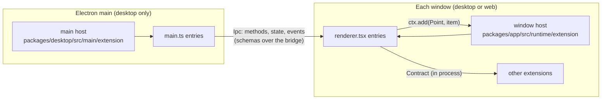
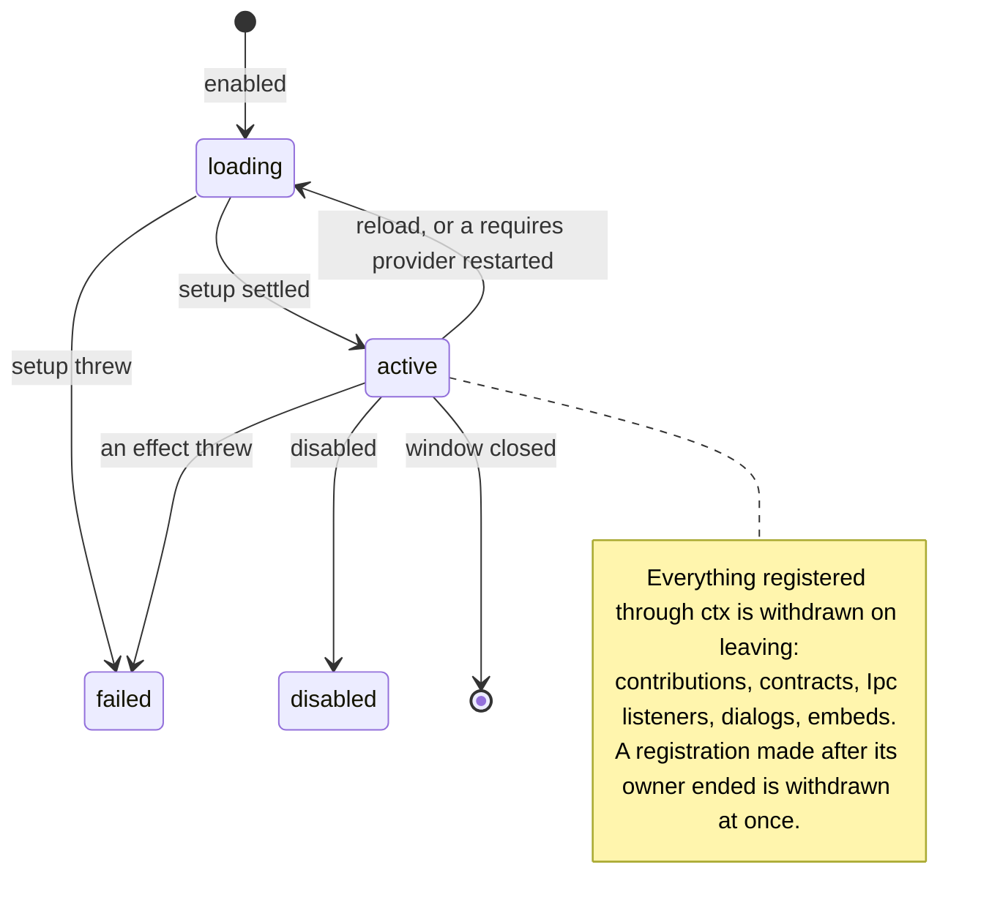
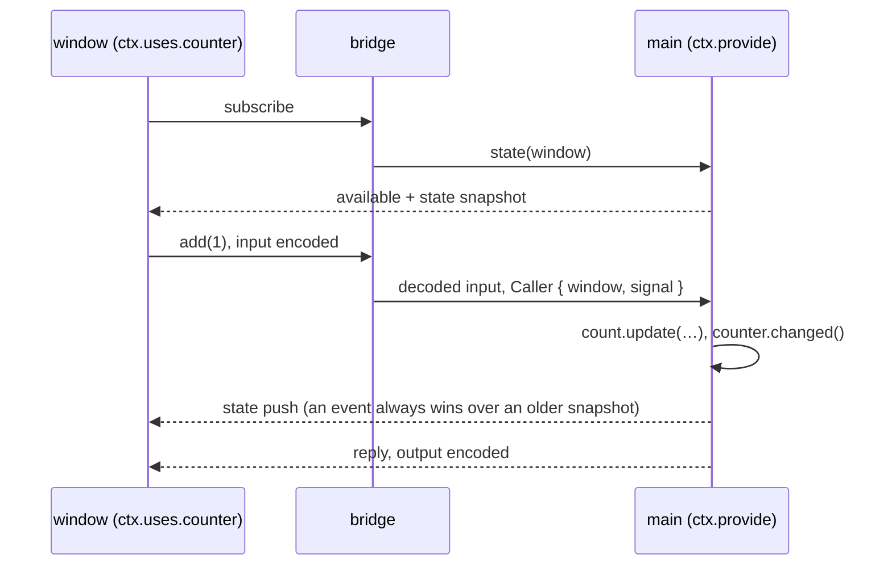

# GUI extensions

Every feature of the desktop and web app that is not the core shell is an extension: the terminal, review, files, the browser, SSH, WSL, the updater and more. Each one builds only on the SDK in [`src/sdk`](src/sdk). The SDK is typed so that the common bugs fail to compile or fail the lint, and every declaration has TSDoc, so editor hovers answer most questions. This guide shows how the parts fit. [`src/example`](src/example) is a small extension that the guide walks through. CI compiles and tests it, but it is not a built-in, so it never ships.

- Window SDK: `@opencode/gui-extensions/sdk` ([`index.ts`](src/sdk/index.ts))
- Main-process SDK: `@opencode/gui-extensions/sdk/main` ([`main.ts`](src/sdk/main.ts))
- Rules for agents: [`AGENTS.md`](AGENTS.md)



## Anatomy

```text
src/example/
├── index.ts          Extension.define: id, provides, uses, requires, stores, i18n
├── contract.ts       tokens other code may import: Ipc, Contract, Point
├── renderer.ts(x)    window entry, default export Setup<typeof definition>
├── main.ts           main entry, default export MainSetup (desktop only)
├── i18n/en.ts        English copy; other locales load when picked
└── *.test.ts         unit tests of logic that carries a contract
```

`Extension.define` is the manifest. The host reads it before any entry loads.

| Field      | What it declares                                                              | In the context                 |
| ---------- | ----------------------------------------------------------------------------- | ------------------------------ |
| `id`       | Prefix of every id: commands, panel keys, stored keys, contract and Ipc ids   | `ctx.id`                       |
| `os`       | The operating systems it runs on; omit it to run everywhere, the web included |                                |
| `provides` | Contracts from the window entry, Ipcs from the main entry                     | `ctx.provide(token, impl)`     |
| `uses`     | Optional dependencies; the extension works while one is missing               | `ctx.uses.name()` is `Live<T>` |
| `requires` | Hard dependencies; setup runs only while all are active                       | `ctx.requires.name` is `T`     |
| `stores`   | Window state the host loads before it is read                                 | `ctx.stores.name`              |
| `i18n`     | The extension's copy                                                          | `ctx.t`, `ctx.plural`          |

- [`src/renderer.ts`](src/renderer.ts) and [`src/main.ts`](src/main.ts) list the built-ins, each through `Extension.compose`. These are the only files that name extensions.
- Another extension imports only your `contract.ts`.
- A window entry loads with the app. Keep it small and put heavy UI behind `lazy()`.

## The context

Setup receives one context. Components read the same object with `useExtension<typeof definition>()`.

| Member                | Window                                                                                      | Main                                   |
| --------------------- | ------------------------------------------------------------------------------------------- | -------------------------------------- |
| Host APIs             | `ctx.layout`, `ctx.sessions`, `ctx.storage`, `ctx.desktop`, … (see the [catalog](#catalog)) | `ctx.storage`, `ctx.windows`, …        |
| Optional dependencies | `ctx.uses.name`: `Accessor<Live<T>>`                                                        |                                        |
| Hard dependencies     | `ctx.requires.name`: `T`                                                                    |                                        |
| Declared stores       | `ctx.stores.name`: `Persisted`, or `(session) => Persisted`                                 | `ctx.storage.store(key, …)`            |
| Contribute to a point | `ctx.add(Point, item)`                                                                      | `ctx.add(MenubarItem, item)`           |
| Provide a dependency  | `ctx.provide(Contract, impl)`                                                               | `ctx.provide(Ipc, impl)`               |
| Lifetime              | Solid's `onCleanup` and `ctx.signal`                                                        | `ctx.scope` (`signal`, `addFinalizer`) |
| Copy                  | `ctx.t(key, params)`, `ctx.plural(key, count)`                                              | the same                               |

- Host APIs are getters: an API you never read costs nothing.
- Points and contracts are tokens: `ctx.add(Command, …)`, `ctx.provide(FileTree, …)`.
- Reading a token you did not declare is a compile error.

```ts
const setup: Setup<typeof definition> = (ctx) => {
  const changes = ctx.uses.changes // Accessor<Live<Changes>>
  const prefs = ctx.stores.prefs.value // loaded before setup
  ctx.add(Command, { id: "open", title: ctx.t("open"), run: () => ctx.layout.settings(ctx.id) })
}
```

### Lifetimes



- A registration ends with the current Solid owner: a component, a `createKeyed` run, or else the extension.
- Teardown of other work: `onCleanup` in the window, `ctx.scope.addFinalizer` in main. Setup returns nothing.
- Setup may be async. After each `await` there is no owner. Return if `ctx.signal.aborted` (main: `ctx.scope.signal`).

## Primitives

| Primitive                                    | Use it for                                                                    |
| -------------------------------------------- | ----------------------------------------------------------------------------- |
| `Extension.define(definition)`               | The manifest, typed so `Setup<typeof definition>` sees the declarations       |
| `Extension.compose(...definitions)`          | A process's list; fails to compile on a missing or duplicate provider         |
| `Point.define<T>(id)`                        | A place your extension renders and others contribute to                       |
| `Contract.define<T, Id>(id)`                 | An in-process API one extension provides to others                            |
| `Ipc.define(spec)` / `Ipc.ref<typeof T>(id)` | The main ↔ window contract, or a reference to it that loads no schemas       |
| `Store.global` / `Store.session`             | Declared state the host loads before you read it                              |
| `createKeyed(source, fn, { otherwise })`     | Side effects per provider generation or per value; the only sanctioned effect |
| `createLatest(source, fetch)`                | Async data that never suspends and drops stale replies                        |
| `createVisitState(initial)`                  | State that resets each time the user routes back to the session               |
| `useExtension` / `usePanel` / `useDrawer`    | The context, the panel frame, and the narrow-screen drawer in components      |
| `onIdle(fn)`                                 | Preloading a lazy chunk while the app is idle                                 |
| `Scope` (main)                               | `ctx.scope`: `signal`, `addFinalizer`, `fork`, `close`                        |

```ts
// Side work per generation of a provider: the listener ends with the generation.
createKeyed(ctx.uses.updater, (updater) => void updater.on("check", () => act("check")))

// Async data: `latest` stays while a new request runs; a stale reply is dropped.
const info = createLatest(ctx.uses.pairing, (pairing, signal) => pairing.info(undefined, { signal }))

// Forget a selection when the user goes Home and back.
const [selected, setSelected] = createVisitState<string | undefined>(undefined)

// Compile the settings page while the app idles, not when settings opens.
const Page = lazy(() => import("./page"))
onCleanup(onIdle(() => void Page.preload()))
```

## Catalog

Each line links to the file whose TSDoc covers every field.

### Points

| Point                               | Process | What an item is                                                                             |
| ----------------------------------- | ------- | ------------------------------------------------------------------------------------------- |
| [`Command`](src/sdk/points.ts)      | window  | A palette command with an optional keybind and slash command                                |
| [`MenuItem`](src/sdk/points.ts)     | window  | An item of a host menu: the side panel + menu, Add server, a server row                     |
| [`Panel`](src/sdk/points.ts)        | window  | Tabs in the session's side region, or the dock                                              |
| [`SettingsPage`](src/sdk/points.ts) | window  | A settings page, a section on a host page, or rows in a host section                        |
| [`Server`](src/sdk/points.ts)       | window  | A source of servers, such as SSH hosts                                                      |
| [`LinkHandler`](src/sdk/points.ts)  | window  | Opens local links, such as file paths in messages                                           |
| [`TitlebarItem`](src/sdk/points.ts) | window  | A titlebar pill, or the dev channel badge as a toggle                                       |
| [`Slot`](src/sdk/points.ts)         | window  | Content for `window.bottom`, `session.header`, `session.panel.end`, `session.panel.sidebar` |
| [`Style`](src/sdk/points.ts)        | window  | CSS imported with `?inline`                                                                 |
| [`MenubarItem`](src/sdk/main.ts)    | main    | An item of the native app menu                                                              |

### Host APIs

| Property                     | Type ([window](src/sdk/host-apis.ts), [main](src/sdk/main.ts)) | What it does                                                      |
| ---------------------------- | -------------------------------------------------------------- | ----------------------------------------------------------------- |
| `ctx.layout`                 | `Layout`                                                       | Side panel tabs, the dock, scroll offsets, settings, open project |
| `ctx.sessions`               | `Sessions`                                                     | Sessions of open tabs, and the mounted `MountedSession`           |
| `ctx.storage`                | `Storage`                                                      | Stores for keys known only at runtime, and window memory          |
| `ctx.system`                 | `System`                                                       | Clipboard, saving files, `openExternal`                           |
| `ctx.desktop`                | `Desktop \| undefined`                                         | Desktop-only: reveal, launch, installed, zoom, forceFocus         |
| `ctx.dialogs`                | `Dialogs`                                                      | Dialogs that close when the extension goes away                   |
| `ctx.links`                  | `Links`                                                        | Routes a local link to the best `LinkHandler`                     |
| `ctx.embeds`                 | `Embeds`                                                       | Shows a web page the main entry created                           |
| `ctx.build`                  | `Build`                                                        | Version, channel, platform, packaged                              |
| `ctx.locale`                 | `Locale`                                                       | Locale and writing direction                                      |
| `ctx.appearance`             | `Appearance`                                                   | The user's mono font                                              |
| `ctx.router`                 | `Router`                                                       | The route path, and whether it is changing                        |
| `ctx.keybinds`               | `Keybinds`                                                     | Display and matching of command keybinds                          |
| `ctx.servers`                | `Servers`                                                      | Ids of the servers the app lists                                  |
| `ctx.workspaces`             | `Workspaces`                                                   | `on("remove", …)` when a workspace is removed                     |
| `ctx.scope` (main)           | `Scope`                                                        | The instance's lifetime                                           |
| `ctx.storage` (main)         | `Storage`                                                      | Synchronous storage, the same `Persisted` shape                   |
| `ctx.log` (main)             | `Log`                                                          | The desktop log file                                              |
| `ctx.lifecycle` (main)       | `Lifecycle`                                                    | `restart(handoff, { keep })`                                      |
| `ctx.build` (main)           | `Build`                                                        | The same shape; `platform` is `"desktop"`                         |
| `ctx.serverEndpoints` (main) | `ServerEndpoints`                                              | URL and credentials of a server the windows use                   |
| `ctx.windows` (main)         | `Windows`                                                      | The app's main windows                                            |
| `ctx.embeds` (main)          | `Embeds`                                                       | `create(view, window)` places a web page                          |
| `ctx.cli` (main)             | `Cli`                                                          | The opencode CLI the app runs                                     |

## Ipc: main ↔ window

An `Ipc` is the typed contract between an extension's main entry and its windows. Its schemas encode every value that crosses the bridge.



- Define it in `contract.ts`. Its id is your extension id, or `<id>.<name>`.
- The main entry provides it; the window entry declares it in `uses`. Your own Ipc goes in both `provides` and `uses`.
- On the web there is no main process: the Ipc is always `inactive`.
- `IpcsProvided<typeof renderer, typeof main>` fails to compile when a window uses an Ipc that no main entry provides. [`src/builtins.typecheck.ts`](src/builtins.typecheck.ts) checks the built-ins.
- To name an Ipc without loading its schemas at startup, declare a reference and load the full token from the chunk that needs it:

```ts
// browser/index.ts: a type-only import, so no schemas load at startup
import type { BrowserPane } from "./ipc"
const Pane = Ipc.ref<typeof BrowserPane>("browser.pane")
export default Extension.define({ id: "browser", provides: { pane: Pane }, uses: { pane: Pane } })

// browser/model.ts: a chunk that loads with the first session and imports the full token
const pane = ctx.uses.pane.load(BrowserPane) // pending until this runs, here and in other extensions
```

A reference cannot go in `requires`: setup would wait for a `load` that only setup can make.

## Live and failure handling

`ctx.uses.name()` returns `Live<T>`, one object per provider transition.

| Status                     | When                                                                     | What the user must see                    |
| -------------------------- | ------------------------------------------------------------------------ | ----------------------------------------- |
| `pending`                  | The provider has not started, e.g. main is not up yet                    | A loading state, or nothing to click      |
| `active`                   | `value` is the contract or client; `generation` counts restarts          | The feature                               |
| `inactive`, `"restarting"` | It was active and comes back                                             | Keep what the user had; resume after      |
| `inactive`, `"disabled"`   | Turned off, not composed, or not on this platform (every Ipc on the web) | An unavailable state, never a dead button |
| `inactive`, `"failed"`     | Its setup threw                                                          | An unavailable state                      |

- Offer an action only while it can answer, or let it answer with an unavailable state. Never a silent `return`, never an endless spinner.
- `createKeyed` runs once per active generation. What the run registers ends with that generation. `otherwise` runs while there is none.
- An Ipc that goes away is a suspension, not a failure: keep what the user had and resume when it returns. No retry timer.
- An Ipc call can reject while the event that explains it is still in flight. When main reports an outcome as an event, let the event decide.
- A contribution that throws renders nothing and records the error. The rest of the window keeps working.

The example offers its pill and its reset command only while main's counter is active:

<!-- source: src/example/renderer.ts#counter -->

```ts
// One run per generation of main's counter. What it adds goes away with the generation, so nothing is offered
// while the counter cannot answer (on the web, always).
createKeyed(ctx.uses.counter, (counter) => {
  ctx.add(TitlebarItem, () =>
    pill.value.shown
      ? {
          id: "count",
          label: ctx.plural("pill.label", counter.state() ?? 0),
          title: ctx.t("pill.title"),
          icon: "plus",
          run: () => void counter.add(1, { signal: ctx.signal }),
        }
      : undefined,
  )
  ctx.add(Command, {
    id: "reset",
    get title() {
      return ctx.t("command.reset")
    },
    run: () => counter.reset(undefined, { signal: ctx.signal }),
  })
})
```

## Stored state

Desktop windows load storage over IPC; the web reads it synchronously. A read before load passes every web test and still breaks desktop, so declare your stores.

| Kind                                    | Window value                                             | Loads                         |
| --------------------------------------- | -------------------------------------------------------- | ----------------------------- |
| `Store.global(schema, initial, from?)`  | `ctx.stores.name.value`: never undefined                 | Before setup                  |
| `Store.session(schema, initial, from?)` | `ctx.stores.name(session).value`: undefined until loaded | When the session mounts       |
| `ctx.storage.store(key, options)`       | `value`: undefined until loaded                          | When opened; for runtime keys |
| main `ctx.storage.store(key, options)`  | `value`: always defined                                  | Synchronously                 |

```ts
// details/index.ts: older homes, newest first: the earlier id's namespace, then the app key before it.
prefs: Store.global(Prefs, { projectExpanded: true, serverExpanded: true }, [
  "extension.summary.prefs",
  { key: "settings.v3", pick: (value: { sessionSummary?: unknown } | null) => value?.sessionSummary },
]),

// review/index.ts: one session's slice of an app key that holds every session.
session: Store.session(SessionState, { open: [] }, {
  key: "layout",
  sessions: "sessionView",
  pick: (entry: { reviewOpen?: unknown } | undefined) => entry && { open: entry.reviewOpen },
}),
```

- Keys live in your namespace: `extension.<id>.<name>`.
- `from` imports an older value once, while the store holds none. A list names older homes, newest first. With `pick`, the older key stays for its other owners.
- `update(fn)` edits the draft, or returns the next value, which replaces the stored one, in both processes. In the window it waits for the load, then applies in call order.
- `Storage.remove(key, { from })` reads as `initial` again and never imports `from` again.
- Renaming an extension moves three things: stored keys (`from`), command ids (the keybind rename map in `packages/app/src/settings/keybinds/migration.ts`), and panel keys (`Panel.legacy`). Never drop user data.

## Runtime rules

- **Derive, don't sync.** A value computed from other state is a `createMemo` or a plain function. Never an effect that calls a setter.
- **Effects only for external sync.** `createKeyed` syncs with something outside Solid: the DOM, a widget, an embed, an Ipc subscription. Logic a user action causes goes in the handler.
- **The lint bans raw effects.** `createEffect`, `createRenderEffect` and `createComputed` may not be imported outside `src/sdk`. An escape hatch needs an `oxlint-disable` comment with a reason.
- **Suspense only on first load.** Wrap each `lazy()` component in its own `<Suspense>`, read async data through `.latest` or `createLatest`, and never read a refetching resource in render: it blanks the nearest boundary.
- **Stable objects.** Return the same object from `Panel.list` and reactive contributions while nothing changed, so the host never remounts.
- **No timeline work.** `session.header` is the only timeline surface.
- **No module state.** Keep state inside setup; module state survives a reload and leaks across windows.

## Testing

| Gate                       | Where                                                                                                                                                                      | Catches                                                                                               |
| -------------------------- | -------------------------------------------------------------------------------------------------------------------------------------------------------------------------- | ----------------------------------------------------------------------------------------------------- |
| Composition compile checks | [`sdk/compose.typecheck.ts`](src/sdk/compose.typecheck.ts), [`builtins.typecheck.ts`](src/builtins.typecheck.ts), [`example/compositions.ts`](src/example/compositions.ts) | A missing `requires` provider, two providers of one token, a window Ipc no main entry provides        |
| Graph matrix               | `packages/app/component-tests/extension-graph.spec.ts`                                                                                                                     | A `requires` cycle; a consumer that fails when one optional provider is disabled                      |
| Keeper suites              | `packages/app/e2e/regression/`                                                                                                                                             | What the user sees, per product area                                                                  |
| Unit tests                 | `*.test.ts` beside the code                                                                                                                                                | Pure logic with a contract: paths, migrations, protocols                                              |
| Lint gate                  | `bun run lint` (oxlint, ast-grep, `script/sdk-docs.ts`); `bun run lint:changed`                                                                                            | Raw effects, app imports, module state, undocumented SDK, a guide block that differs from the example |

- Test a main entry through its `Ipc` contract with real inputs, not Electron mocks. The example's [`main.test.ts`](src/example/main.test.ts) does.
- Drive the race the user hits: a reload during async setup, a store that loads late, an Ipc that goes away and returns.

## Build your first extension

The example keeps a count in main and shows it as a titlebar pill. A command hides the pill, and a reset command appears while main's counter is up.

1. **Define the Ipc.** The schemas type both sides and encode every value.

<!-- source: src/example/contract.ts -->

```ts
import { Schema } from "effect"
import { Ipc } from "../sdk"

/** A count the main process keeps for the whole app; every window sees the same value. */
export const Counter = Ipc.define({
  id: "example.counter",
  state: Schema.Number,
  methods: {
    /** Adds a number to the count and returns the new count. */
    add: { input: Schema.Number, output: Schema.Number },
    /** Sets the count back to 0. */
    reset: {},
  },
})
```

2. **Write the definition.** Main provides the counter and the window uses it. The pill preference is a declared store, so the host loads it before setup.

<!-- source: src/example/index.ts -->

```ts
import { Schema } from "effect"
import { Extension, Store } from "../sdk"
import { Counter } from "./contract"
import en from "./i18n/en"

const Pill = Schema.Struct({ shown: Schema.Boolean })

/** The guide's example: a count main keeps, shown as a titlebar pill. Not a built-in, so it never ships. */
export default Extension.define({
  id: "example",
  // The main entry provides the counter and the window entry uses it, so the window keeps working without it.
  provides: { counter: Counter },
  uses: { counter: Counter },
  stores: { pill: Store.global(Pill, { shown: true }) },
  i18n: { en },
})
```

3. **Add the copy.** Count-sensitive copy uses plural keys, which `ctx.plural` picks.

<!-- source: src/example/i18n/en.ts -->

```ts
export default {
  "command.show": "Show counter in titlebar",
  "command.hide": "Hide counter in titlebar",
  "command.reset": "Reset counter",
  "pill.label.one": "{{count}} click",
  "pill.label.other": "{{count}} clicks",
  "pill.title": "Add one to the counter",
}
```

4. **Provide it from main.** Main storage is synchronous. Each change calls `changed()`, which pushes the new state to every window.

<!-- source: src/example/main.ts -->

```ts
import { Schema } from "effect"
import type { MainSetup } from "../sdk/main"
import { Counter } from "./contract"

const setup: MainSetup = (ctx) => {
  // Main storage is synchronous: `value` is always defined.
  const count = ctx.storage.store("count", { schema: Schema.Number, initial: 0 })

  const counter = ctx.provide(Counter, {
    state: () => count.value,
    add: (by) => {
      count.update((value) => value + by)
      counter.changed()

      return count.value
    },
    reset: () => {
      count.update(() => 0)
      counter.changed()
    },
  })
}

export default setup
```

5. **Write the window entry.** The toggle command needs no main process. The pill and the reset command live in one `createKeyed` run per generation of the counter, so they exist only while main can answer.

<!-- source: src/example/renderer.ts -->

```ts
import { Command, createKeyed, TitlebarItem, type Setup } from "../sdk"
import type definition from "./index"

const setup: Setup<typeof definition> = (ctx) => {
  const pill = ctx.stores.pill

  // Needs no main process: it only flips a stored preference.
  ctx.add(Command, {
    id: "toggle",
    get title() {
      return ctx.t(pill.value.shown ? "command.hide" : "command.show")
    },
    run: () => pill.update((draft) => ({ shown: !draft.shown })),
  })

  // One run per generation of main's counter. What it adds goes away with the generation, so nothing is offered
  // while the counter cannot answer (on the web, always).
  createKeyed(ctx.uses.counter, (counter) => {
    ctx.add(TitlebarItem, () =>
      pill.value.shown
        ? {
            id: "count",
            label: ctx.plural("pill.label", counter.state() ?? 0),
            title: ctx.t("pill.title"),
            icon: "plus",
            run: () => void counter.add(1, { signal: ctx.signal }),
          }
        : undefined,
    )
    ctx.add(Command, {
      id: "reset",
      get title() {
        return ctx.t("command.reset")
      },
      run: () => counter.reset(undefined, { signal: ctx.signal }),
    })
  })
}

export default setup
```

6. **Compose it.** Each process lists its extensions with `Extension.compose`, and `IpcsProvided` checks the two lists against each other.

<!-- source: src/example/compositions.ts -->

```ts
import { Extension, type IpcsProvided } from "../sdk"
import example from "./index"
import setup from "./renderer"

/** The window composition, as `src/renderer.ts` lists the built-ins. */
export const renderer = Extension.compose({ ...example, renderer: async () => ({ default: setup }) })

/** The main composition, as `src/main.ts` lists the built-ins. */
export const main = Extension.compose({ ...example, main: () => import("./main") })

// The window uses `example.counter`, so a main entry must provide it: without `main` above, this fails to compile.
export const ipcs: IpcsProvided<typeof renderer, typeof main> = true
```

7. **Test it.** [`main.test.ts`](src/example/main.test.ts) drives the main entry through the `Counter` contract: every change reaches the windows, and a reload keeps the count. `packages/app/component-tests/extension-example.spec.ts` mounts the window entry in the real host, with and without main's counter.

8. **Ship it.** A built-in joins the two lists. The example stays out of them, so nothing changes for users:

```ts
// src/renderer.ts
{ ...example, renderer: eager(exampleRenderer) },
// src/main.ts
{ ...example, main: () => import("./example/main") },
```

Then run `bun run lint` and `bun typecheck`. The lint includes `script/sdk-docs.ts`, which fails when an SDK declaration has no TSDoc, or when a code block in this guide differs from the example.
